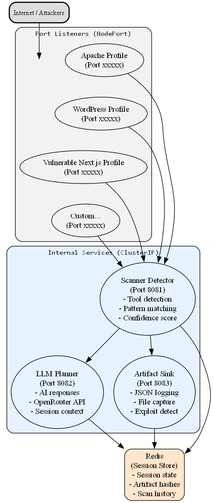

# HoneyKube - Kubernetes-Ready Adaptive Honeypot System


A distributed, AI-powered honeypot system designed for Kubernetes that uses OpenRouter to access multiple LLM providers for generating realistic vulnerable server responses. HoneyKube captures attacker behavior, detects scanning tools, and logs all interactions for security analysis.


## Security Warning

**NEVER run HoneyKube as root!** Honeypots are intentionally exposed to attackers. Running as root could allow attackers to gain elevated privileges if any vulnerability is discovered.

## Features

- **AI-Powered Responses**: Uses OpenRouter to access 100+ LLM models (GPT-4, Claude, Gemini, Llama, etc.) for contextually appropriate vulnerable server responses
- **Never Returns 404**: Dynamic content generation ensures every path returns realistic vulnerable content - never reveals it's a honeypot
- **Scanner Detection**: Identifies 25+ scanning tools and exploit frameworks (sqlmap, nmap, Metasploit, React2Shell, WPScan, etc.)
- **Session Memory**: Tracks attacker sessions with Redis for progressive response generation
- **Artifact Capture**: Stores uploaded payloads and logs with SHA-256 hashing
- **Flexible Fingerprints**: YAML-based service profiles with default responses for common sensitive paths
- **Exploit Stage Detection**: Distinguishes reconnaissance from exploitation attempts
- **Kubernetes Native**: Designed for horizontal scaling with HPA support
- **Modular Configuration**: All settings via environment variables

## Architecture



## Project Structure

```
HoneyKube/
├── services/
│   ├── port-listener/        # Main honeypot service
│   │   ├── main.py
│   │   ├── requirements.txt
│   │   └── Dockerfile
│   ├── scanner-detector/     # Scanner classification service
│   │   ├── main.py
│   │   ├── requirements.txt
│   │   └── Dockerfile
│   ├── llm-planner/          # AI response generation (OpenRouter)
│   │   ├── main.py
│   │   ├── requirements.txt
│   │   └── Dockerfile
│   └── artifact-sink/        # Logging & artifact storage
│       ├── main.py
│       ├── requirements.txt
│       └── Dockerfile
├── shared/                   # Shared Python modules
│   ├── schemas.py           # Pydantic models
│   ├── redis_client.py      # Redis session management
│   └── utils.py             # Common utilities
├── config/
│   └── fingerprints/        # Service fingerprint profiles
│       ├── apache.yaml
│       ├── wordpress.yaml
│       └── nextjs.yaml      # CVE-2025-55182 & CVE-2025-66478
├── tools/                   # Exploit scanners for testing
│   ├── README.md            # Scanner documentation
│   ├── react2shell_scanner.py  # Next.js RCE scanner
│   ├── wordpress_scanner.py    # WordPress exploit scanner
│   └── apache_scanner.py       # Apache exploit scanner
├── k8s/                     # Kubernetes manifests
│   ├── namespace.yaml
│   ├── configmaps.yaml
│   ├── secrets.yaml
│   ├── redis.yaml
│   ├── scanner-detector.yaml
│   ├── llm-planner.yaml
│   ├── artifact-sink.yaml
│   ├── port-listeners.yaml
│   ├── hpa-network.yaml
│   └── deploy.sh
├── .env.example             # Environment variable template
├── docker-compose.yaml      # Local development
├── Dockerfile.shared        # Shared module build
└── README.md
```

## Exploit Scanners for Testing

The `tools/` directory contains real-world exploit scanners to test your honeypots:

```bash
# Install dependencies
pip install requests tqdm

# Test Next.js honeypot with React2Shell scanner
python tools/react2shell_scanner.py -u http://localhost:3000 -v

# Test WordPress honeypot
python tools/wordpress_scanner.py -u http://localhost:8000 -v

# Test Apache honeypot
python tools/apache_scanner.py -u http://localhost:80 -v
```

See `tools/README.md` for full documentation on available exploits.

## Complete Setup Guide (Fresh Machine)

### IMPORTANT: Create a Dedicated User (DO NOT RUN AS ROOT!)

Running HoneyKube as root is a serious security risk. Always create a dedicated non-root user:

```bash
# Create honeypot user (run these as root, then switch)
sudo useradd -m -s /bin/bash honeykube
sudo passwd honeykube

# Add to docker group (required for Docker)
sudo usermod -aG docker honeykube

# Add sudo access if needed (optional, for kubectl setup)
sudo usermod -aG sudo honeykube

# Switch to the new user
su - honeykube

# Verify you're not root
whoami  # Should output: honeykube
id      # Should show uid != 0
```

### Step 1: Install Dependencies (Ubuntu/Debian)

```bash
# Update system
sudo apt update && sudo apt upgrade -y

# Install required packages
sudo apt install -y curl wget git apt-transport-https ca-certificates gnupg lsb-release

# Install Docker
curl -fsSL https://get.docker.com -o get-docker.sh
sudo sh get-docker.sh
sudo usermod -aG docker $USER

# Log out and back in for docker group to take effect
exit
su - honeykube

# Verify Docker installation
docker --version
docker run hello-world

# Install Docker Compose
sudo curl -L "https://github.com/docker/compose/releases/latest/download/docker-compose-$(uname -s)-$(uname -m)" -o /usr/local/bin/docker-compose
sudo chmod +x /usr/local/bin/docker-compose
docker-compose --version
```

### Step 2: Install Kubernetes Tools

```bash
# Install kubectl
curl -LO "https://dl.k8s.io/release/$(curl -L -s https://dl.k8s.io/release/stable.txt)/bin/linux/amd64/kubectl"
sudo install -o root -g root -m 0755 kubectl /usr/local/bin/kubectl
kubectl version --client

# Install minikube (Recommended for development/testing)
curl -LO https://storage.googleapis.com/minikube/releases/latest/minikube-linux-amd64
sudo install minikube-linux-amd64 /usr/local/bin/minikube
minikube start --driver=docker
```

### Step 3: Get an OpenRouter API Key

1. Go to [OpenRouter](https://openrouter.ai/keys)
2. Sign in or create an account
3. Click "Create Key"
4. Copy the key (you'll need it in Step 5)

**Note**: OpenRouter gives you access to 100+ LLM models including GPT-4, Claude, Gemini, Llama, and more with a single API key!

### Step 4: Clone and Configure HoneyKube

```bash
# Clone the repository
git clone https://github.com/MohamedAYassin/HoneyKube
cd HoneyKube

# Set proper permissions
chmod -R 750 .
chmod +x k8s/deploy.sh
```

### Step 5: Configure Environment

```bash
# Copy the example environment file
cp .env.example .env

# Edit with your API key
nano .env
```

Update the file with your OpenRouter API key:

```bash
OPENROUTER_API_KEY=your-actual-api-key-here

# Optional: Choose a different model (default: google/gemini-2.0-flash-001)
# See https://openrouter.ai/models for all available models
LLM_MODEL=google/gemini-2.0-flash-001
```

For Kubernetes deployment, also update:

```bash
nano k8s/secrets.yaml
```

```yaml
stringData:
  OPENROUTER_API_KEY: "your-actual-api-key-here"
```

### Step 6A: Local Development with Docker Compose

```bash
# Build and run all services
docker-compose up --build -d

# Check status
docker-compose ps

# View logs
docker-compose logs -f

# Access honeypots:
# Apache: http://localhost:8080
# WordPress: http://localhost:8000
# Next.js: http://localhost:3000 (CVE-2025-55182/CVE-2025-66478)

# Stop services
docker-compose down
```

### Step 6B: Production Kubernetes Deployment

```bash
# Build Docker images
docker build -f Dockerfile.shared -t honeykube/shared:latest .
docker build -f services/port-listener/Dockerfile -t honeykube/port-listener:latest .
docker build -f services/scanner-detector/Dockerfile -t honeykube/scanner-detector:latest .
docker build -f services/llm-planner/Dockerfile -t honeykube/llm-planner:latest .
docker build -f services/artifact-sink/Dockerfile -t honeykube/artifact-sink:latest .

# For Minikube/local cluster, images are already available if using minikube docker-env
# For remote clusters, push to your registry:
# docker tag honeykube/port-listener:latest your-registry/honeykube/port-listener:latest
# docker push your-registry/honeykube/port-listener:latest

# Deploy to Kubernetes
cd k8s
./deploy.sh apply

# Verify deployment
kubectl get pods -n honeykube
kubectl get svc -n honeykube

# Access honeypots:
# Apache: http://<node-ip>:30080
# WordPress: http://<node-ip>:30800
# Next.js: http://<node-ip>:30300 (CVE-2025-55182/CVE-2025-66478)
```

### Step 7: Verify Installation

```bash
# Test Apache honeypot
curl http://localhost:30080/

# Test WordPress honeypot
curl http://localhost:30800/wp-login.php

# Test Next.js honeypot (React Server Components RCE)
curl http://localhost:30300/

# Check logs
kubectl logs -l app.kubernetes.io/component=port-listener -n honeykube

# View Redis session data
kubectl exec -it redis-0 -n honeykube -- redis-cli KEYS '*'
```

### Step 8: Run Test Suite

HoneyKube includes a comprehensive test script to verify all components:

```bash
# Make test script executable
chmod +x k8s/test.sh

# Run tests for Kubernetes deployment
./k8s/test.sh --k8s

# Or for Docker Compose (local) deployment
./k8s/test.sh --local
```

The test suite checks:
- Pre-flight (user permissions, required tools)
- Kubernetes resources (pods, services, secrets, PVCs)
- Redis connectivity and health
- All service health endpoints
- Honeypot HTTP responses (Apache, WordPress, Next.js)
- Scanner detection functionality (sqlmap, React2Shell)
- Artifact sink logging
- Full request flow integration

### Firewall Configuration (Production)

```bash
# Allow honeypot ports (adjust based on your setup)
sudo ufw allow 30080/tcp  # Apache honeypot
sudo ufw allow 30800/tcp  # WordPress honeypot
sudo ufw allow 30300/tcp  # Next.js honeypot (CVE-2025-55182/CVE-2025-66478)

# Block direct access to internal services
sudo ufw deny 6379/tcp    # Redis
sudo ufw deny 8081/tcp    # Scanner detector
sudo ufw deny 8082/tcp    # LLM planner
sudo ufw deny 8083/tcp    # Artifact sink

sudo ufw enable
```

## Redis (Built-in)

HoneyKube deploys its own Redis instance as a Kubernetes StatefulSet. You don't need to install or configure Redis separately.

**Redis Features:**

- Deployed as `redis:7-alpine` image
- Persistent storage via PersistentVolumeClaim (5Gi)
- AOF persistence enabled (`appendonly yes`)
- Memory limit: 256MB with LRU eviction
- Health checks configured

**Redis Data:**

- Session data: `session:<src-ip>:<port>`
- Artifact metadata: `artifact:<sha256>`
- Artifact index: `artifacts:ip:<src-ip>`, `artifacts:all`

## Included Fingerprint Profiles

### Apache HTTP Server (Port 8080)
- Simulates Apache 2.4.49 on Ubuntu
- Targets: Path traversal (CVE-2021-41773), RCE, LFI attacks
- NodePort: 30080

### WordPress (Port 8000)  
- Simulates WordPress 5.9.3 on PHP 7.4
- Targets: XML-RPC attacks, plugin exploits, authentication bypass
- NodePort: 30800

### Next.js Vulnerable (Port 3000)
- **CVE-2025-55182**: React Server Components RCE
- **CVE-2025-66478**: Prototype Pollution leading to RCE
- Simulates Next.js 14.1.0 with React 19.0.0 RC
- Detects React2Shell scanner by Assetnote
- Targets: Server Actions, Next-Action header manipulation, prototype pollution attacks
- NodePort: 30300

The Next.js profile specifically detects and responds to the React2Shell exploit pattern:
- `NEXT_REDIRECT` / `NEXT_NOT_FOUND` indicators
- `constructor:constructor` prototype pollution chains
- `process.mainModule.require('child_process')` payloads
- Assetnote scanner User-Agent detection
- `x-action-*` / `Next-Action` header patterns

## Dynamic Response Generation (Never 404)

HoneyKube **never returns a 404 error**. Instead, it dynamically generates realistic, vulnerable-looking content for any path attackers request. This prevents attackers from discovering which paths don't exist, making the honeypot more convincing.

### How It Works

1. **Fingerprint Default Responses** - Paths defined in fingerprint YAML files return pre-configured responses
2. **Smart Pattern Matching** - Recognizes sensitive path patterns (`.env`, `.git/`, `backup/`, etc.)
3. **Dynamic Generation** - Unknown paths generate content based on file extension

### Supported File Extensions

| Extension | Generated Content |
|-----------|-------------------|
| `.php`, `.phtml` | HTML with PHP comments, fake DB credentials |
| `.js`, `.mjs` | JavaScript with API keys, config objects |
| `.json` | JSON with credentials, debug flags |
| `.xml` | XML config with database passwords |
| `.yaml`, `.yml` | YAML config with secrets |
| `.ini`, `.cfg`, `.conf` | INI-style config files |
| `.sql`, `.dump` | SQL dumps with user tables and password hashes |
| `.txt`, `.log` | Log files with connection strings and errors |
| `.bak`, `.backup`, `.old` | Backup files with exposed credentials |
| `.pem`, `.key`, `.crt` | Certificate/private key content |
| `.csv` | User export files with password hashes |
| `.sh`, `.bash` | Shell scripts with hardcoded secrets |
| `.zip`, `.tar`, `.gz` | Fake archive headers |
| `/api/*` paths | JSON API responses with debug info |
| Directories (`/`) | Directory listings with juicy file links |

### Example Responses

**Request:** `GET /.env`
```
APP_KEY=base64:RandomGeneratedKey...
DB_PASSWORD=Pr0d_DB_P@ssw0rd!
AWS_SECRET_KEY=wJalrXUtnFEMI/K7MDENG...
```

**Request:** `GET /config/database.yml`
```yaml
database:
  host: localhost
  username: admin
  password: Y@ml_S3cret_Pass!
```

**Request:** `GET /backup/users.sql`
```sql
INSERT INTO users VALUES
(1, 'admin', '$2y$10$HashedPassword...', 'admin');
```

Every response includes realistic fake credentials to entice attackers to continue their attack, generating more logs and artifacts for analysis.

## Adding New Fingerprints

### 1. Create a new fingerprint YAML

Create a file in `config/fingerprints/` (e.g., `mysql.yaml`):

```yaml
name: mysql-server
port: 3306
protocol: tcp
server_header: "MySQL 5.7.32"
version: "5.7.32"
os_hint: "Ubuntu 18.04"
banner: |
  5.7.32-0ubuntu0.18.04.1

vuln_tags:
  - sql_injection
  - authentication_bypass
  - privilege_escalation
  - udf_exploitation

behavior_hints:
  - "Accept empty passwords for root from localhost"
  - "Show verbose error messages with query details"
  - "Expose user list via information_schema"
  - "Allow LOAD DATA LOCAL INFILE"

default_responses:
  # Define default responses for common requests
```

### 2. Create a ConfigMap

Add to `k8s/configmaps.yaml` or create a new file:

```yaml
apiVersion: v1
kind: ConfigMap
metadata:
  name: fingerprint-mysql
  namespace: honeykube
data:
  fingerprint.yaml: |
    # Paste your fingerprint YAML here
```

### 3. Create a new Port Listener deployment

Add to `k8s/port-listeners.yaml`:

```yaml
apiVersion: apps/v1
kind: Deployment
metadata:
  name: port-listener-mysql
  namespace: honeykube
spec:
  replicas: 2
  selector:
    matchLabels:
      app: port-listener-mysql
  template:
    spec:
      containers:
        - name: port-listener
          image: honeykube/port-listener:latest
          env:
            - name: LISTEN_PORT
              value: "3306"
            - name: FINGERPRINT_PATH
              value: "/config/fingerprint.yaml"
          volumeMounts:
            - name: fingerprint
              mountPath: /config
      volumes:
        - name: fingerprint
          configMap:
            name: fingerprint-mysql
---
apiVersion: v1
kind: Service
metadata:
  name: port-listener-mysql
  namespace: honeykube
spec:
  type: NodePort
  ports:
    - port: 3306
      targetPort: 3306
      nodePort: 30306
  selector:
    app: port-listener-mysql
```

### 4. Apply changes

```bash
kubectl apply -f k8s/configmaps.yaml
kubectl apply -f k8s/port-listeners.yaml
```

## Scaling

### Manual Scaling

```bash
# Scale port listeners
kubectl scale deployment port-listener-apache -n honeykube --replicas=5

# Scale LLM planner
kubectl scale deployment llm-planner -n honeykube --replicas=3
```

### Automatic Scaling (HPA)

HPAs are pre-configured in `k8s/hpa-network.yaml`:

- Port listeners: 2-10 replicas (70% CPU target)
- LLM planner: 2-5 replicas (60% CPU target)

Monitor scaling:

```bash
kubectl get hpa -n honeykube
```

## Monitoring & Analysis

### View Logs

```bash
# Stream logs from all port listeners
kubectl logs -l app.kubernetes.io/component=port-listener -n honeykube -f

# View artifact sink logs
kubectl logs -l app=artifact-sink -n honeykube -f
```

### Access Stored Data

```bash
# Port-forward to artifact-sink for stats
kubectl port-forward svc/artifact-sink 8083:8083 -n honeykube

# Get statistics
curl http://localhost:8083/stats
```

### Log File Location

Logs are stored in the `honeykube-logs` PVC:

- Format: `/logs/honeypot-YYYY-MM-DD.jsonl`
- Each line is a complete JSON log entry

### Artifact Storage

Captured files are stored in the `honeykube-artifacts` PVC:

- Format: `/artifacts/<sha256>_<original_filename>`
- Metadata stored in Redis

## Security Considerations

1. **No Real Execution**: The system NEVER executes attacker commands - all responses are simulated
2. **Network Isolation**: Internal services are protected by NetworkPolicy
3. **Resource Limits**: All pods have CPU/memory limits to prevent DoS
4. **Non-root Containers**: Services run as non-root users
5. **Read-only ConfigMaps**: Fingerprints are mounted read-only

## Configuration

### Environment Variables

| Variable              | Service         | Default                           | Description                |
| --------------------- | --------------- | --------------------------------- | -------------------------- |
| `LISTEN_PORT`         | all             | varies                            | Port to listen on          |
| `REDIS_HOST`          | port-listener, artifact-sink | redis                | Redis hostname             |
| `REDIS_PORT`          | port-listener, artifact-sink | 6379                 | Redis port                 |
| `OPENROUTER_API_KEY`  | llm-planner     | -                                 | OpenRouter API key         |
| `OPENROUTER_BASE_URL` | llm-planner     | https://openrouter.ai/api/v1      | OpenRouter API URL         |
| `LLM_MODEL`           | llm-planner     | google/gemini-2.0-flash-001       | LLM model to use           |
| `LLM_TEMPERATURE`     | llm-planner     | 0.7                               | Response temperature       |
| `LLM_MAX_TOKENS`      | llm-planner     | 4096                              | Max response tokens        |
| `REQUEST_TIMEOUT`     | llm-planner     | 30                                | API timeout in seconds     |
| `MAX_RETRIES`         | llm-planner     | 3                                 | API retry attempts         |
| `LOG_LEVEL`           | all             | INFO                              | Logging level              |
| `SESSION_TTL`         | port-listener   | 3600                              | Session TTL in seconds     |

### Supported LLM Models (via OpenRouter)

OpenRouter provides access to 100+ models. Some popular choices:

| Model                              | Speed   | Cost    | Quality  |
| ---------------------------------- | ------- | ------- | -------- |
| `google/gemini-2.0-flash-001`      | Fast    | Low     | Good     |
| `google/gemini-pro`                | Medium  | Low     | Good     |
| `anthropic/claude-3.5-sonnet`      | Medium  | Medium  | Excellent|
| `openai/gpt-4o-mini`               | Fast    | Low     | Good     |
| `openai/gpt-4o`                    | Medium  | High    | Excellent|
| `meta-llama/llama-3.1-70b-instruct`| Medium  | Low     | Good     |

See [OpenRouter Models](https://openrouter.ai/models) for the full list.

## LLM Response Format

The AI generates responses in this JSON schema:

```json
{
  "status_code": 200,
  "headers": {
    "Content-Type": "text/html",
    "Server": "Apache/2.4.41"
  },
  "body": "<html>...</html>",
  "delay_ms": 150,
  "notes": "Simulated SQL error disclosure"
}
```

## Troubleshooting

### LLM/OpenRouter API Errors

```bash
# Check planner logs
kubectl logs -l app=llm-planner -n honeykube

# Verify API key
kubectl get secret llm-config -n honeykube -o jsonpath='{.data.OPENROUTER_API_KEY}' | base64 -d

# Check which model is configured
kubectl get configmap llm-config -n honeykube -o jsonpath='{.data.LLM_MODEL}'

# Test API key manually
curl https://openrouter.ai/api/v1/models -H "Authorization: Bearer YOUR_API_KEY"
```

### Redis Connection Issues

```bash
# Check Redis status
kubectl exec -it redis-0 -n honeykube -- redis-cli ping

# View Redis logs
kubectl logs redis-0 -n honeykube

# Check Redis memory usage
kubectl exec -it redis-0 -n honeykube -- redis-cli INFO memory
```

### Port Listener Not Responding

```bash
# Check health endpoint
kubectl exec -it <pod-name> -n honeykube -- curl http://localhost:8080/_health

# View pod events
kubectl describe pod <pod-name> -n honeykube
```

### Common Issues

| Issue                     | Cause             | Solution                                                                           |
| ------------------------- | ----------------- | ---------------------------------------------------------------------------------- |
| Pods stuck in `Pending`   | PVC not bound     | Check storage class: `kubectl get pvc -n honeykube`                               |
| LLM 401/403 error         | Invalid API key   | Verify key in secrets.yaml or .env                                                |
| Redis connection refused  | Redis not ready   | Wait for Redis pod: `kubectl wait --for=condition=ready pod/redis-0 -n honeykube` |
| NodePort not accessible   | Firewall blocking | Open ports 30080, 30800, 30300 in firewall                                         |
| LLM timeout errors        | Model overloaded  | Try a different model or increase REQUEST_TIMEOUT                                  |

## Credits

- [React2Shell Scanner](https://github.com/assetnote/react2shell-scanner) by Assetnote - The `react2shell_scanner.py` tool is based on their research and code.

## License

MIT License - See LICENSE file for details.

## Disclaimer

This software is intended for security research and education purposes only. Deploy honeypots responsibly and in compliance with applicable laws. The author is not responsible for misuse of this software.

**Security Best Practices:**

- Always run as a non-root user
- Deploy on an isolated network/VLAN
- Monitor honeypot traffic separately from production
- Regularly review captured artifacts in a sandboxed environment
- Keep the system updated
